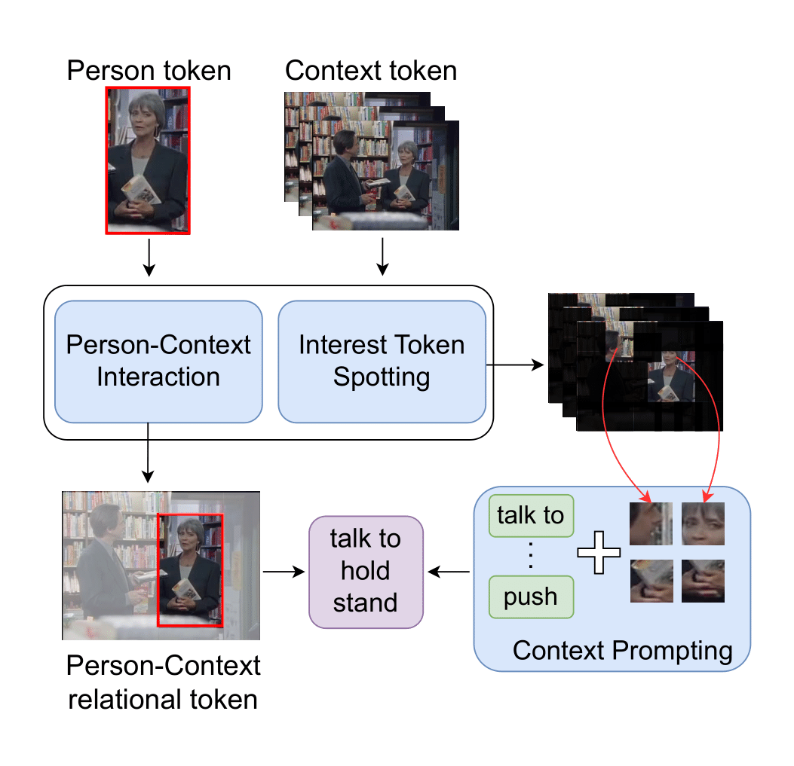

# [WACV'25] Spatio-Temporal Context Prompting for Zero-Shot Action Detection (ST-CLIP)

<h1 align="center"> 
    
</h1>

The Official PyTorch implementation of [**Spatio-Temporal Context Prompting for Zero-Shot Action Detection (WACV'25)**](https://arxiv.org/abs/2408.15996).

Wei-Jhe Huang<sup>1</sup>, [Min-Hung Chen](https://minhungchen.netlify.app/)<sup>2</sup>, [Shang-Hong Lai](https://www.cs.nthu.edu.tw/~lai/)<sup>1</sup><br>
<sup>1</sup>National Tsing Hua University, <sup>2</sup>[NVIDIA Research Taiwan](https://research.nvidia.com/labs/twn/)<br>

[[`Paper`](https://arxiv.org/abs/2408.15996)] [[`Website`](https://webber2933.github.io/ST-CLIP-project-page/)] [[`BibTeX`](#citation)]

This work proposes **Spatio-Temporal Context Prompting for Zero-Shot Action Detection (ST-CLIP)**, which aims to adapt the pretrained image-language model to detect unseen actions. We propose the Person-Context Interaction which employs pretrained knowledge to model the relationship between people and their surroundings, and the Context Prompting module which can utilize visual information to augment the text content. To address multi-action videos, we further introduce the Interest Token Spotting mechanism to identify the visual tokens most relevant to each individual action. To evaluate the ability to detect unseen actions, we propose a comprehensive benchmark on different datasets. The experiments show that our method achieves superior results compared to previous approaches and can be further extended to multi-action videos.

For business inquiries, please visit our website and submit the form: [NVIDIA Research Licensing](https://www.nvidia.com/en-us/research/inquiries/).

## Installation 

Please check [INSTALL.md](INSTALL.md) to install the environment.

## Data Preparation

Please check [DATA.md](DATA.md) to prepare data needed for training or inference. We provide the data for J-HMDB first, and the others will be released as soon as possible.

## Training and Inference

Please check [GETTING_STARTED.md](GETTING_STARTED.md) for the training/inference instructions.

## Acknowledgement

We are very grateful to the authors of [HIT](https://github.com/joslefaure/HIT) and [X-CLIP](https://github.com/microsoft/VideoX/tree/master/X-CLIP) for open-sourcing their code from which this repository is heavily sourced. If your find these researchs useful, please consider citing their paper as well.

## Citation

If this project helps you in your research or project, please cite this paper:

```
@article{huang2024spatio,
        title={Spatio-Temporal Context Prompting for Zero-Shot Action Detection},
        author={Huang, Wei-Jhe and Chen, Min-Hung and Lai, Shang-Hong},
        journal={arXiv preprint arXiv:2408.15996},
        year={2024}
      }
```

## Licenses

Copyright © 2025, NVIDIA Corporation. All rights reserved.

This work is made available under the NVIDIA Source Code License-NC. Click [here](LICENSE) to view a copy of this license.